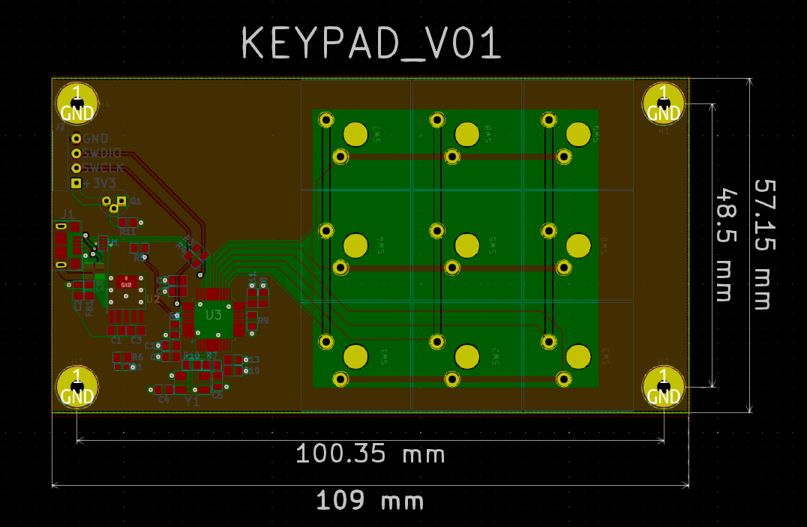

# KEYPAD_V01

### Summary: ###
  This is a 3x3 keypad designed around the budget STMF103 Cortex-M3 series of microcontrollers. 
  It interfaces to the PC with a USB micro B connector and can be programmed through the SWD interface adjacent to it.

  The BOM, schematic PDF, and gerber files are all accessible in the _'Outputs/'_ folder. 
  Other project files are not included because they add clutter and can be generated from the project itself in KiCad.
  Thanks.
  
  
